# Vega: A Multi-Age Interactive Exoplanet Exploration Website

**Vega** is an immersive and educational website designed to introduce users of all ages to the fascinating world of **exoplanets**: planets that orbit stars outside our solar system. Exoplanets offer exciting possibilities for life beyond Earth and help answer the fundamental question, "Are we alone in the universe?" This project targets different audiences, including children, high schoolers, and adults, offering tailored content and interactive elements to ensure an engaging learning experience.

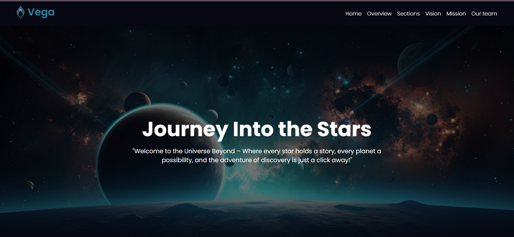

## Table of Contents

- [Features](#features)
- [Children's Section](#childrens-section-interactive-learning-and-personalized-adventures)
- [High Schooler's Section](#high-schoolers-section-comprehensive-ebook-and-interactive-learning)
- [Adults' Section](#adults-section-in-depth-articles-and-interactive-simulations)
- [Data Sources and Machine Learning Insights](#data-sources-and-machine-learning-insights)
- [Vega's Team](#vegas-team)
- [Resources](#resources)

## Features:

- **Children's Section**: Customized stories, interactive games, and engaging animations to introduce
  children to the fascinating world of exoplanets.

- **High Schooler's Section**: An e-book with detailed information, a podcast, and visualizations about
  exoplanets, along with predictions about the habitability of exoplanets based on our machine
  learning model. There is also a quiz to test your knowlege for exoplanets.

- **Adults' Section**: Articles on exoplanets, interactive simulations, and exploration of the potential for
  life on exoplanets using machine learning and NASA resources.

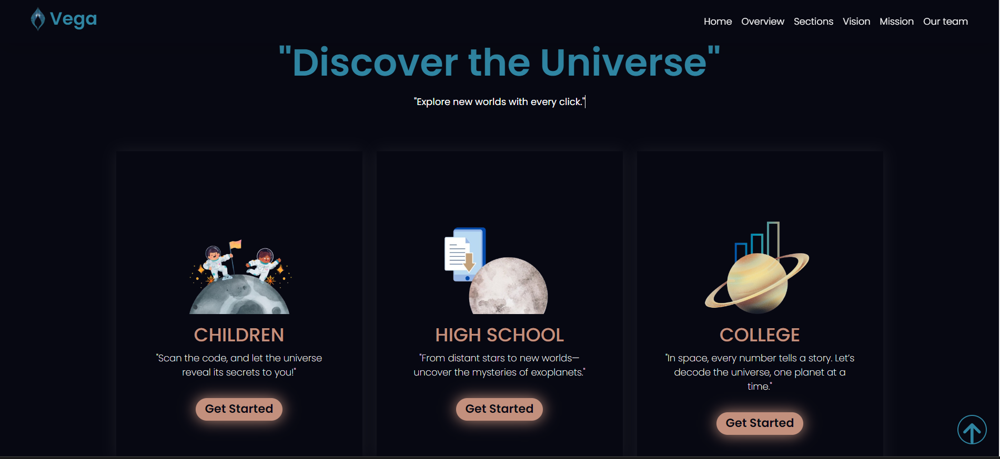

### Children's Section: Interactive Learning and Personalized Adventures

Welcome Our Young Explorers! Here you can customize a story for only you to learn about the exciting worlds beyond Our Earth. Get Ready!!

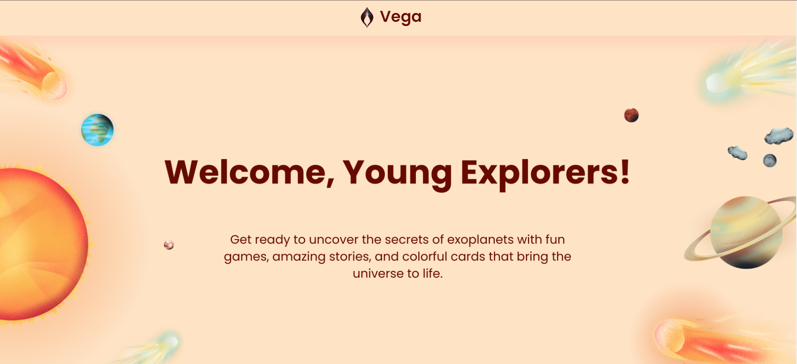

Your experience begins with a fun game, where you can launch a rocket and embark on a thrilling journey through our solar system.

  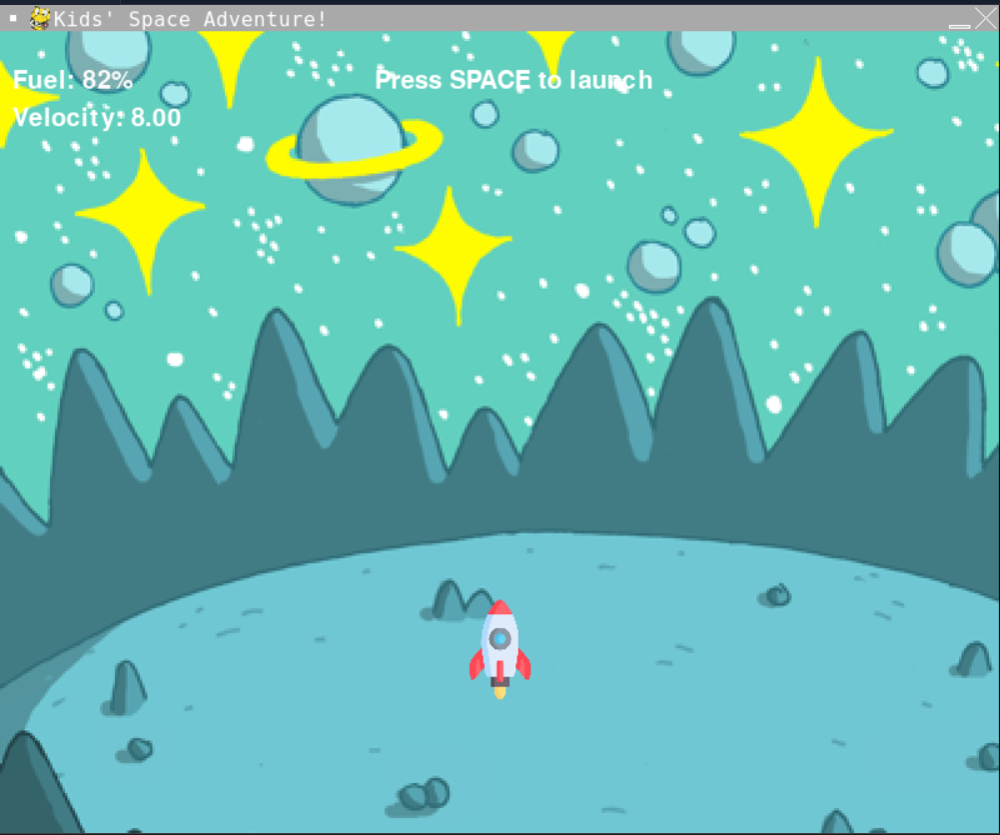
  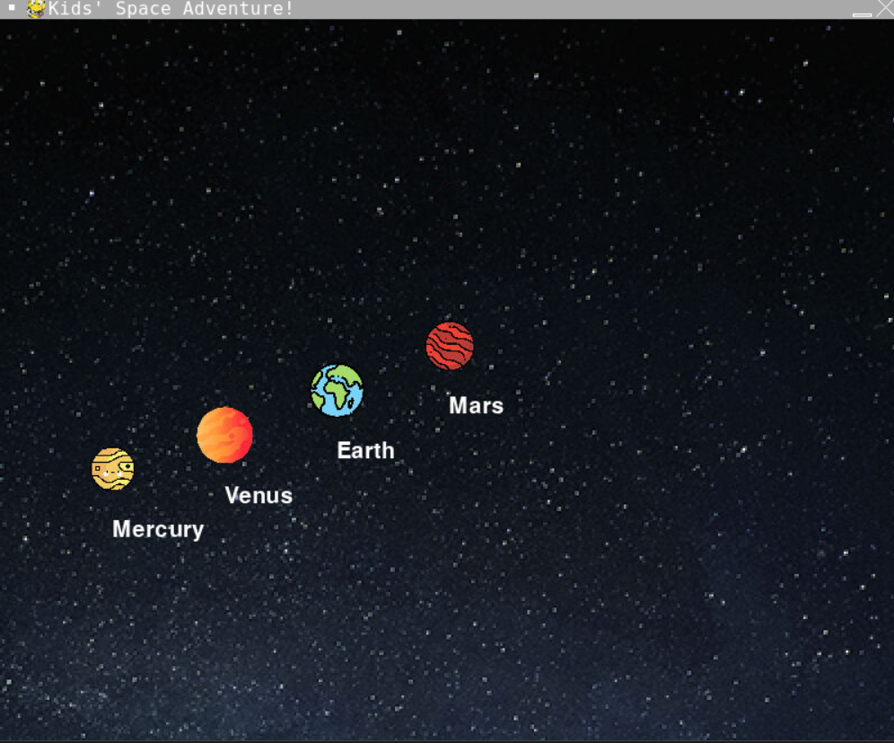
  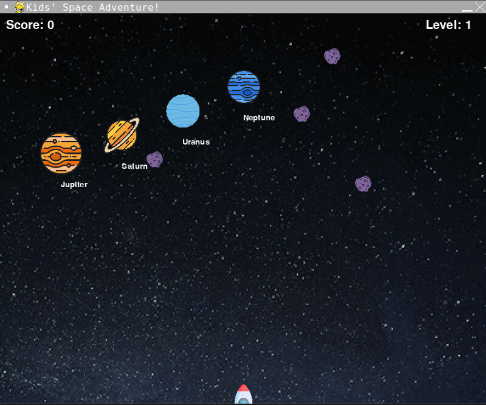

Once they return to our website, the adventure continues with a **personalized story** that’s tailored to each child’s name, age, interests, and spoken language. This customization is powered by the **Gemini Key**, making every story unique and engaging.

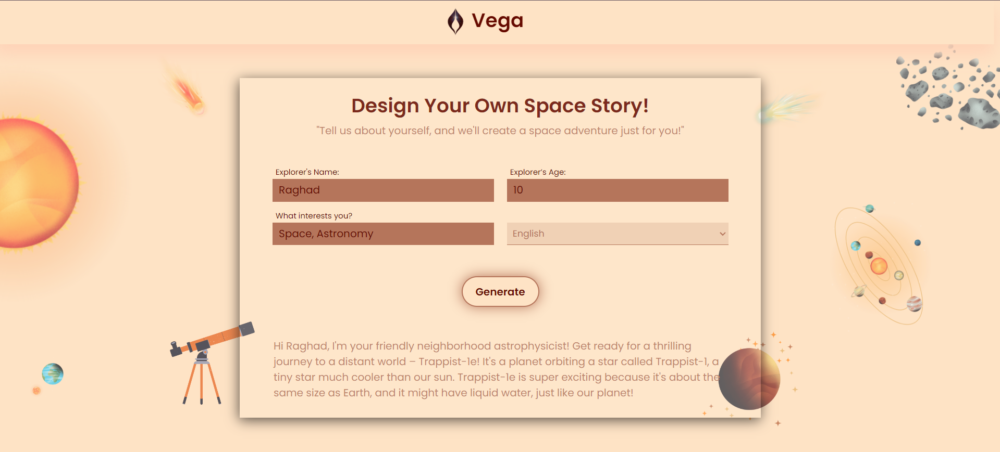

The story is presented as an **audio narration** with rich **visual aids**, ensuring that children remain captivated while learning about the wonders of space and exoplanets. This section is crafted to inspire curiosity and ignite a passion for exploration in a fun and accessible way.

### High Schooler's Section: Comprehensive eBook and Interactive Learning

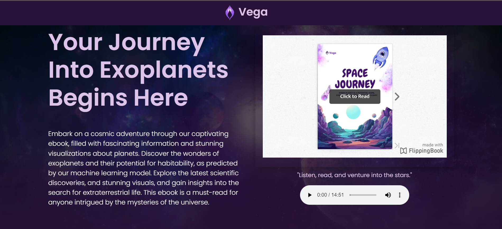

For high school students, we offer an engaging eBook that presents information in a clear and easily understandable manner. At the end of the eBook, readers will find an overall comparison featuring data visualizations that highlight the most significant exoplanets, based on key characteristics such as mass, radius, temperature, and distance. At the end there is the predictions of our Machine Learning Model that predicts the habitability for the exoplanets based on NASA’s Exoplanet Archive: Planetary System Composite Data that achieves accuracy 98%.

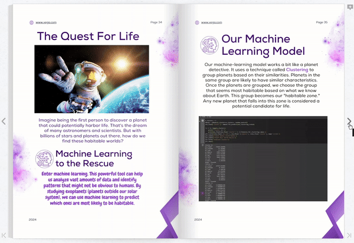

In addition to the eBook, we provide a **podcast** for those who prefer listening to reading. This way, students can absorb the information in a format that suits them best.

To reinforce learning, we include a short **interactive quiz** at the end of the eBook, allowing users to test their understanding of the material covered. This comprehensive approach ensures that high schoolers gain a solid grasp of exoplanets and their fascinating features.

  
  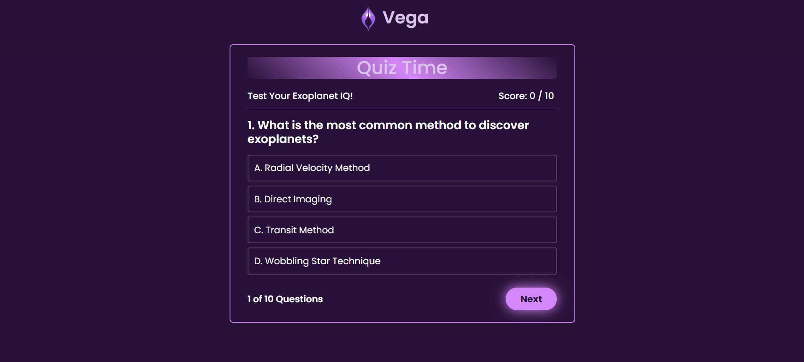
  

### Adults' Section: In-Depth Articles and Interactive Simulations

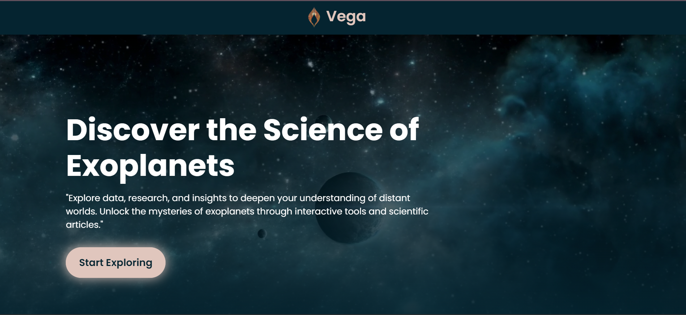

For adults, we have created comprehensive articles that provide detailed information and data about exoplanets. These articles feature **data visualizations** that allow for direct comparisons between exoplanets, Earth, and Jupiter, enhancing the understanding of their unique characteristics.

Additionally, we have developed an **interactive simulation** where users can observe exoplanets orbiting their respective stars. This immersive experience aims to deepen the appreciation of the dynamics of these distant worlds and their relationship with their stars.

  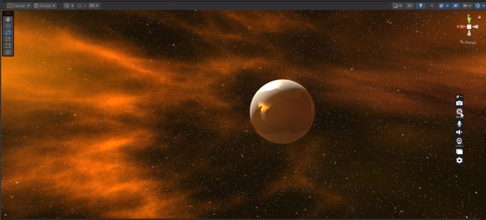
  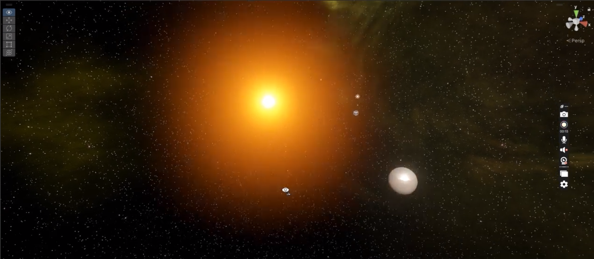

## Data Sources and Machine Learning Insights

If you're wondering where we sourced the data for our articles aimed at adults and the eBook for high schoolers, we utilized NASA’s **Planetary System Composite Data Set**. This dataset allows us to extract information on exoplanets based on various features, such as the hottest, largest radius, or closest to Earth.

In addition to the dataset, we developed a **machine learning model** to predict habitability based on data clustering, focusing on exoplanets that are closest to Earth. At the end of each article and eBook section dedicated to an exoplanet, we provide our model's prediction regarding its habitability that achieved accuracy 98%, along with a justification of the reasons behind this assessment. This comprehensive approach ensures that readers not only understand the data but also the implications of our findings.

## Vega's Team

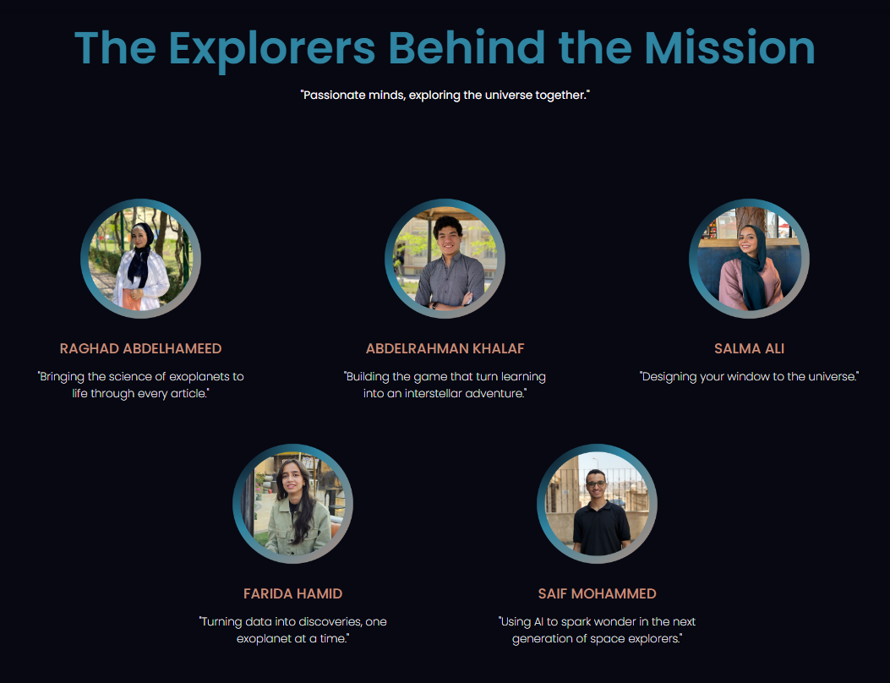

- [Abdelrahman Khalaf](https://github.com/Khalaf649)
- [Farida Hamid](https://github.com/faridahamid)
- [Raghad Abdelhameed](https://github.com/RaghadAbdelhameed)
- [Saif Mohammed](https://github.com/SaifMohammed22)
- [Salma Ali](https://github.com/Salmaa-Ali)

## Resources

This project utilizes the following resources:

1. [NASA’s Exoplanet Archive: Planetary System Composite Data](https://exoplanetarchive.ipac.caltech.edu/cgi-bin/TblView/nph-tblView?app=ExoTbls&config=PSCompPars)
2. [Gemini API](https://ai.google.dev/gemini-api)
3. [Exoplanets Cards Design by NASA’s Exoplanet Travel Bureau](https://exoplanets.nasa.gov/alien-worlds/exoplanet-travel-bureau/?intent=021)
4. [Notebook LM](https://notebooklm.google.com/)
5. [Exoplanets Photos](https://science.nasa.gov/gallery/exoplanets/)
6. [3D Model of Kepler-186f](https://sketchfab.com/3d-models/kepler-186f-c484b8b4aa9248b6998b6222d62f5a77)
7. [Information about Exoplanets and the Wobble Effect](https://spaceplace.nasa.gov/all-about-exoplanets/en/#:~:text=Planets%20that%20orbit%20around%20other,other%20stars%20are%20called%20exoplanets)
8. [Exoplanets Simulation](https://eyes.nasa.gov/apps/exo/#/)
9. [Free Skyboxes for Space Textures](https://assetstore.unity.com/packages/2d/textures-materials/sky/free-skyboxes-space-178953)
10. [Eyes on Exoplanets (NASA Visualization Tool)](https://eyes.nasa.gov/apps/exo/#/?browse_destination=Featured)

Explore the wonders of exoplanets and discover the possibilities of life beyond our solar system with Vega!
